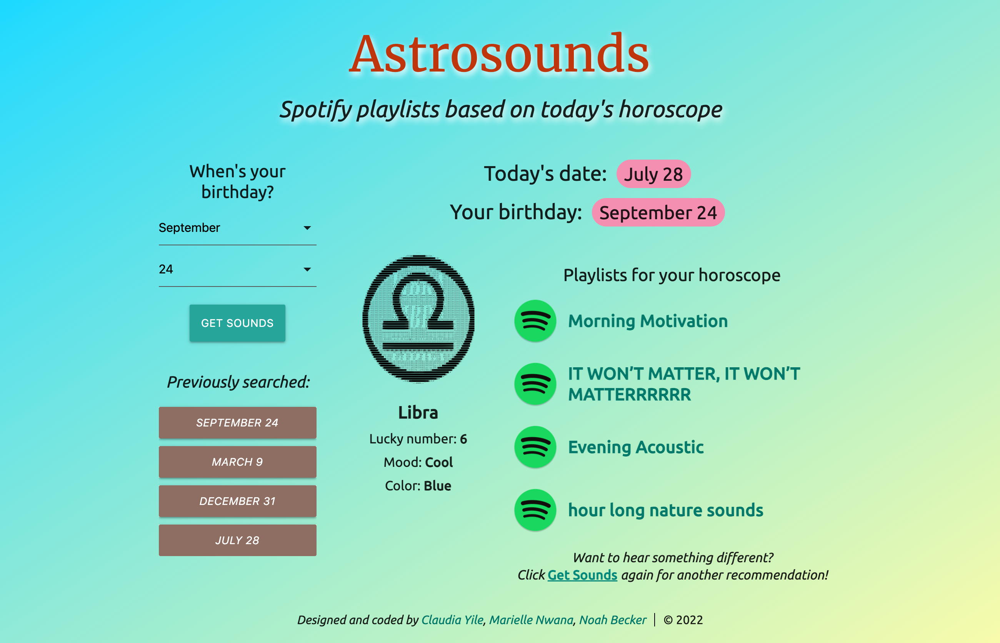

# AstroSounds

## Deployed application
[https://noah35becker.github.io/astrosounds/](https://noah35becker.github.io/astrosounds/)

## Purpose / functionality
This applications provides Spotify playlist recommendations based on the user's daily horoscope.
- The user inputs their birthday, then clicks "Get Sounds"
- Outputs based on their daily horoscope include:
    - Spotify playlist recommendations (including the option to search again if they want different recommendations)
    - Their horoscope's lucky number, color and mood
- Previously searched birthdays are stored in localStorage, so that the user can easily return to the app for new recommendations every day!

## Built with
* HTML 
* CSS
* [<em>Materialize</em> CSS framework](https://materializecss.com/about.html)
* Javascript / jQuery 
* [<em>Aztro</em> (horoscope) API](https://materializecss.com/about.html)
* [<em>TextProbe</em> (keyword extractor) API](https://rapidapi.com/textprobe/api/textprobe/)
* [<em>Spotify Scraper</em> API](https://rapidapi.com/DataFanatic/api/spotify-scraper/)

##

## Contributors
- [Noah Becker](https://github.com/noah35becker)
- [Marielle Nwana](https://github.com/mnwana)
- [Claudia Yile](https://github.com/claudiayile)
